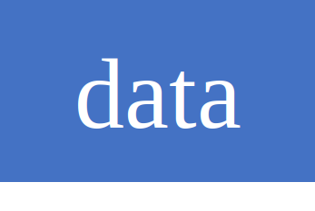

### What is Adversarial Transferability?

### Why Adversarial Transferability?

### Reference
- This repo lists relevant papers summarized in our survey paper.
  [[pdf]](https://arxiv.org/pdf/2111.11368.pdf)
  - Jindong Gu, Philip Torr (To edit)
 
* Abbreviation tag, e.g.,   

### Papers
#### 2022
- data Improving the Transferability of Targeted Adversarial Examples through Object-Based Diverse Input.
  [[pdf]](https://openaccess.thecvf.com/content/CVPR2022/papers/Byun_Improving_the_Transferability_of_Targeted_Adversarial_Examples_Through_Object-Based_Diverse_CVPR_2022_paper.pdf)
  [[code]](https://github.com/dreamflake/ODI) 
  Junyoung Byun, Seungju Cho, Myung-Joon Kwon, Hee-Seon Kim, Changick Kim. **CVPR**, 2022. 

- loss Investigating Top-k White-Box and Transferable Black-box Attack.
  [[pdf]](https://openaccess.thecvf.com/content/CVPR2022/papers/Zhang_Investigating_Top-k_White-Box_and_Transferable_Black-Box_Attack_CVPR_2022_paper.pdf)
  [[code]](https://github.com/ChaoningZhang/Top-k-Transferable-Attack) 
  Chaoning Zhang, Philipp Benz, Adil Karjauv, Jae Won Cho, Kang Zhang, In So Kweon. **CVPR**, 2022. 
  
- optimization Stochastic Variance Reduced Ensemble Adversarial Attack for Boosting the Adversarial Transferability.
  [[pdf]](https://openaccess.thecvf.com/content/CVPR2022/papers/Xiong_Stochastic_Variance_Reduced_Ensemble_Adversarial_Attack_for_Boosting_the_Adversarial_CVPR_2022_paper.pdf)
  [[code]](https://github.com/JHL-HUST/SVRE) 
  Yifeng Xiong, Jiadong Lin, Min Zhang, John E. Hopcroft, Kun He. **CVPR**, 2022. 
  
 - loss Cross-Modal Transferable Adversarial Attacks from Images to Videos.
  [[pdf]](https://openaccess.thecvf.com/content/CVPR2022/papers/Wei_Cross-Modal_Transferable_Adversarial_Attacks_From_Images_to_Videos_CVPR_2022_paper.pdf) 
  Zhipeng Wei, Jingjing Chen, Zuxuan Wu, Yu-Gang Jiang. **CVPR**, 2022. 
  
 - loss Improving Adversarial Transferability via Neuron Attribution-Based Attacks.
  [[pdf]](https://openaccess.thecvf.com/content/CVPR2022/papers/Zhang_Improving_Adversarial_Transferability_via_Neuron_Attribution-Based_Attacks_CVPR_2022_paper.pdf)
  [[code]](https://github.com/jpzhang1810/NAA) 
  Jianping Zhang, Weibin Wu, Jen-tse Huang, Yizhan Huang, Wenxuan Wang, Yuxin Su, Michael R. Lyu. **CVPR**, 2022. 
  
  - data Boosting the Transferability of Video Adversarial Examples via Temporal Translation.
  [[pdf]](https://arxiv.org/pdf/2110.09075.pdf)
  [[code]](https://github.com/zhipeng-wei/TT) 
  Zhipeng Wei, Jingjing Chen, Zuxuan Wu, Yu-Gang Jiang. **AAAI**, 2022. 

#### 2021
-  data Admix: Enhancing the Transferability of Adversarial Attacks.
  [[pdf]](https://openaccess.thecvf.com/content/ICCV2021/papers/Wang_Admix_Enhancing_the_Transferability_of_Adversarial_Attacks_ICCV_2021_paper.pdf)
  [[code]](https://github.com/JHL-HUST/Admix) 
  Xiaosen Wang, Xuanran He, Jingdong Wang, Kun He. **ICCV**, 2021. 
  
- generative model On Generating Transferable Targeted Perturbations.
  [[pdf]](https://openaccess.thecvf.com/content/ICCV2021/papers/Naseer_On_Generating_Transferable_Targeted_Perturbations_ICCV_2021_paper.pdf)
  [[code]](https://github.com/Muzammal-Naseer/TTP) 
  Muzammal Naseer, Salman Khan, Munawar Hayat, Fahad Shahbaz Khan, Fatih Porikli. **ICCV**, 2021. 
  
- model Batch Normalization Increases Adversarial Vulnerability and Decreases Adversarial Transferability:   A Non-Robust Feature Perspective.
  [[pdf]](https://openaccess.thecvf.com/content/ICCV2021/papers/Benz_Batch_Normalization_Increases_Adversarial_Vulnerability_and_Decreases_Adversarial_Transferability_A_ICCV_2021_paper.pdf)  
  Philipp Benz, Chaoning Zhang, In So Kweon. **ICCV**, 2021. 

#### 2020
- data Adversarial examples on segmentation models can be easy to transfer.
  [[pdf]](https://arxiv.org/pdf/2111.11368.pdf)
  [[code]](https://arxiv.org/pdf/2111.11368.pdf)
  - Jindong Gu, Hengshuang Zhao, Volker Tresp, Philip Torr. arXiv, 2020. 

#### 2018
- loss Task-generalizable Adversarial Attack based on Perceptual Metric.
  [[pdf]](https://arxiv.org/pdf/1811.09020.pdf) 
  Muzammal Naseer, Salman H. Khan, Shafin Rahman, Fatih Porikli, arxiv, 2018
  
#### 2015
- model Delving into Transferable Adversarial Examples and Black-box Attacks.
  [[pdf]](https://openreview.net/pdf?id=Sys6GJqxl)
  [[code]](https://github.com/sunblaze-ucb/transferability-advdnn-pub) 
  Yanpei Liu, Xinyun Chen, Chang Liu, Dawn Song, **ICLR**, 2015

### Contact

Please contact us (jindong.gu@outlook.com) if 
- you would like to add your paper in this repo,
- you find any mistake in this repo, 
- you have any suggestion for this repo. 

